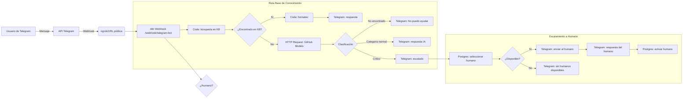

# Bot de Soporte Técnico por Telegram (n8n)

Este proyecto implementa un bot de soporte técnico 24/7 usando n8n, un flujo de trabajo con base de conocimiento, categorización con IA, escalamiento a humano y salida por Telegram. Incluye despliegue por Docker Compose, soporte para ngrok y PostgreSQL para gestionar turnos de soporte humano.

- URL n8n local: `http://localhost:5678`
- Usuario/Contraseña n8n (demo): `admin` / `admin123`
- Puerto DB local: `5433` (mapea al `5432` interno del contenedor)


## Arquitectura




## Requisitos

- Docker Desktop (incluye Docker Compose)
- Cuenta de Telegram y bot creado con @BotFather
- URL pública (ngrok u otra) para recibir webhooks de Telegram
- Token de acceso para GitHub Models (o servicio LLM equivalente) si usas la ruta de IA


## Instalación y Ejecución

Puedes ejecutar n8n con Docker Compose y, opcionalmente, configurar ngrok para exponer la URL pública que Telegram necesita para los webhooks.

### Opción A: Docker Compose (Windows PowerShell)

```powershell
# 1) Ir al directorio del proyecto
Set-Location "c:\\Users\\carli\\OneDrive\\Documents\\Javeriana\\Sistemas-Inteligentes\\proyecto-final\\bot-telegram-soporte-SI\\n8n"

# 2) (Opcional) Si usarás ngrok, define la URL pública
$env:NGROK_URL = "https://<tu-subdominio>.ngrok-free.app"

# 3) Levantar servicios (n8n + PostgreSQL)
docker compose up -d

# 4) Ver estado
docker compose ps
```

Accede a n8n en `http://localhost:5678` con `admin / admin123`.

Notas:
- Si `docker compose` no funciona, prueba `docker-compose`.
- El archivo `n8n/docker-compose.yml` ya define el puerto `5678` para n8n y `5433` para PostgreSQL.

### Opción B: Script simplificado (Bash)

Si tienes Git Bash o WSL:

```bash
cd n8n
# (Opcional) con ngrok
authority=https://<tu-subdominio>.ngrok-free.app
./n8n-simple.sh start "$authority"
# o bien
export NGROK_URL="$authority"
./n8n-simple.sh start
```


## Importar el Flujo del Bot

1. Abre n8n: `http://localhost:5678`.
2. En el menú principal, selecciona Import y elige el archivo `Telegram Bot.json` ubicado en la raíz del repositorio.
3. Verifica que los nodos estén conectados como en la arquitectura.
4. Guarda el workflow y actívalo cuando termines la configuración de APIs.


## Guía de Configuración de APIs

### 1) Telegram

- Crea un bot con @BotFather y obtén el token `TELEGRAM_BOT_TOKEN`.
- En n8n, crea una credencial tipo “Telegram API” y pega tu token.
- En el workflow importado, los nodos `Telegram` usan esa credencial.
- Configura el webhook de Telegram apuntando a tu URL pública + ruta del webhook de n8n.
   - El Webhook node usa `path = telegram-bot`, por lo que la ruta es: `https://TU_URL_PUBLICA/webhook/telegram-bot`.

Configurar webhook desde PowerShell:

```powershell
$env:TELEGRAM_BOT_TOKEN = "<tu-token>"
$env:NGROK_URL = "https://<tu-subdominio>.ngrok-free.app"
Invoke-WebRequest -Uri "https://api.telegram.org/bot$($env:TELEGRAM_BOT_TOKEN)/setWebhook?url=$($env:NGROK_URL)/webhook/telegram-bot"
```

Para probar que está activo:

```powershell
Invoke-WebRequest -Uri "https://api.telegram.org/bot$($env:TELEGRAM_BOT_TOKEN)/getWebhookInfo"
```

### 2) GitHub Models (LLM)

El flujo incluye nodos `HTTP Request` que llaman a `https://models.github.ai/inference/chat/completions` con el modelo `openai/gpt-4o-mini`.

- Crea una credencial en n8n de tipo “HTTP Bearer” con tu token (PAT) o clave del servicio LLM.
- Edita los nodos `HTTP Request` del workflow para usar tu credencial y no hardcodear tokens.
- Encabezados típicos: `Authorization: Bearer <token>`, `Content-Type: application/json`, `Accept: application/json`.

### 3) PostgreSQL (Gestión de soporte humano)

El `docker-compose.yml` expone una BD Postgres interna con credenciales de demo:

- Host (desde n8n): `postgres`
- Puerto: `5432` (interno del contenedor)
- DB: `n8n`
- Usuario: `n8nuser`
- Password: `n8npassword`

En n8n, crea una credencial `Postgres` con esos datos. Crea la tabla necesaria para el flujo (si no existe):

```sql
CREATE TABLE IF NOT EXISTS soporte_humano (
   chat_id text PRIMARY KEY,
   activo boolean NOT NULL DEFAULT false
);
```

La lógica del flujo usa esta tabla para:
- Registrar el chat que solicita `@humano`.
- Encontrar un operador activo distinto del solicitante.
- Alternar el estado `activo` de los operadores.

### 4) ngrok (u otra URL pública)

Telegram requiere un endpoint público para los webhooks. Con ngrok:

- Define `NGROK_URL` antes de levantar n8n para que las URLs internas se configuren correctamente.

PowerShell (Windows):

```powershell
$env:NGROK_URL = "https://<tu-subdominio>.ngrok-free.app"
# Reinicia n8n si ya estaba arriba
cd n8n
docker compose down
docker compose up -d
```

Bash (Git Bash/WSL):

```bash
export NGROK_URL="https://<tu-subdominio>.ngrok-free.app"
cd n8n
./n8n-simple.sh ngrok "$NGROK_URL"
```


## Ejemplos de Consultas y Respuestas Esperadas

- Base de conocimiento (encontrado):
   - Consulta: “python windows” o “¿Cómo instalo Python en Windows?”
   - Respuesta: Lista de pasos predefinidos desde la KB y prefijo de categoría, por ejemplo:
      - “Categoría: Software\n1. Descargar el instalador…\n2. Ejecutar el instalador… …”

- IA categorización y respuesta:
   - Consulta: “¿Cómo listar procesos en Linux?”
   - Respuesta: Categoría devuelta por la IA y explicación (p.ej., comando `ps aux`), enviada al chat.

- Escalamiento a humano:
   - Comando del usuario: “/humano Tengo un incidente crítico con el servidor.”
   - Flujo: se registra el chat en BD, se busca un humano activo distinto y se le envía el mensaje; la respuesta del humano se reenvía al usuario.
   - Respuesta al usuario (si no hay humanos): “No hay personas disponibles para contestarte en este momento. Intente de nuevo más tarde.”

- Fuera de alcance (no encontrado):
   - Si la IA devuelve “No encontrado” (o equivalente), el bot responde: “Lo siento, como asistente técnico especializado no puedo ayudarte con esa pregunta. Si necesitas ayuda en relación a tecnología, estaré encantado de ayudarte.”


## Comandos Útiles

PowerShell (Windows):

```powershell
# Subir servicios
docker compose up -d
# Ver logs
docker compose logs -f
# Reiniciar
docker compose down; docker compose up -d
# Bajar y borrar volúmenes (elimina datos)
docker compose down -v
```

Bash (Git Bash/WSL):

```bash
./n8n-simple.sh start
./n8n-simple.sh logs
./n8n-simple.sh restart
./n8n-simple.sh clean   # elimina datos
```


## Notas de Seguridad

- Cambia las credenciales por defecto de n8n y PostgreSQL en entornos reales.
- No incluyas tokens o llaves en el repositorio. Usa credenciales dentro de n8n.
- Considera HTTPS/TLS y autenticación adicional para producción.


Este repositorio contiene los materiales y configuraciones utilizados en la clase de Tecnologías Emergentes de la Universidad Javeriana.

## 📋 Contenido

- **n8n**: Configuración de Docker Compose para n8n (plataforma de automatización de flujos de trabajo)

## 🚀 n8n - Plataforma de Automatización

n8n es una herramienta de automatización de flujos de trabajo que permite conectar diferentes servicios y APIs de manera visual.

### 🛠️ Configuración

El proyecto incluye una configuración completa de Docker Compose con:
- **n8n**: Plataforma principal de automatización
- **PostgreSQL**: Base de datos para almacenar configuraciones y datos

### 📦 Requisitos Previos

- Docker
- Docker Compose

### 🚀 Instalación y Ejecución

1. **Clonar el repositorio:**
   ```bash
   git clone https://github.com/cesarpalacios/clase-ia-UJaveriana.git
   cd "Clase IA"
   ```

2. **Navegar al directorio de n8n:**
   ```bash
   cd n8n
   ```

3. **Ejecutar con Docker Compose:**
   ```bash
   docker-compose up -d
   ```

4. **Acceder a n8n:**
   - URL: http://localhost:5678
   - Usuario: `admin`
   - Contraseña: `admin123`

### 📊 Servicios Incluidos

| Servicio | Puerto | Descripción |
|----------|--------|-------------|
| n8n | 5678 | Interfaz web de n8n |
| PostgreSQL | 5432 | Base de datos (solo interno) |

### 🔧 Configuración Personalizada

La configuración incluye:
- **Autenticación básica** activada para seguridad
- **Zona horaria** configurada para América/Bogotá
- **Volúmenes persistentes** para datos de n8n y PostgreSQL
- **Variables de entorno** preconfiguradas

### 📁 Estructura de Directorios

```
n8n/
├── docker-compose.yml    # Configuración de servicios
├── n8n_data/            # Datos persistentes de n8n (creado automáticamente)
└── postgres_data/       # Datos de PostgreSQL (creado automáticamente)
```

### 🔄 Comandos Útiles

```bash
# Iniciar servicios
docker-compose up -d

# Ver logs
docker-compose logs -f

# Detener servicios
docker-compose down

# Detener y eliminar volúmenes (¡cuidado: elimina todos los datos!)
docker-compose down -v
```


### 📚 Recursos Adicionales

- [Documentación oficial de n8n](https://docs.n8n.io/)
- [n8n Community](https://community.n8n.io/)
- [Docker Compose Reference](https://docs.docker.com/compose/)


---
